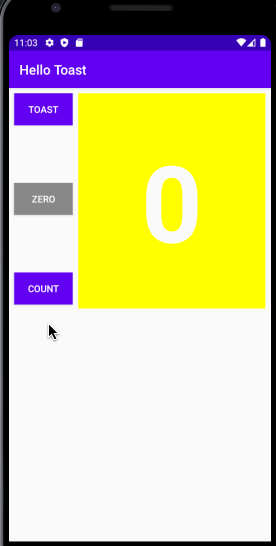

# hello toast

### QUESTION 1
Which two layout constraint attributes on the Zero Button position it vertically equal distance between the other two Button elements? (Pick 2 answers.)  
<b>Answer: android:layout_marginBottom="8dp",android:layout_marginTop="8dp"</b>
### QUESTION 2
Which layout constraint attribute on the Zero Button positions it horizontally in alignment with the other two Buttonelements?  
<b>Answer: app:layout_constraintLeft_toLeftOf="parent"</b>
### QUESTION 3
What is the correct signature for a method used with the android:onClick XML attribute?  
<b>Answer: public void callMethod(View view)</b>
### Question 4
The click handler for the Count Button starts with the following method signature:
public void countUp(View view)
Which of the following techniques is more efficient to use within this handler to change the Button element’s background color? Choose one:  
<b>Answer: Use the view parameter that is passed to the click handler with setBackgroundColor(): view.setBackgroundColor()</b>
